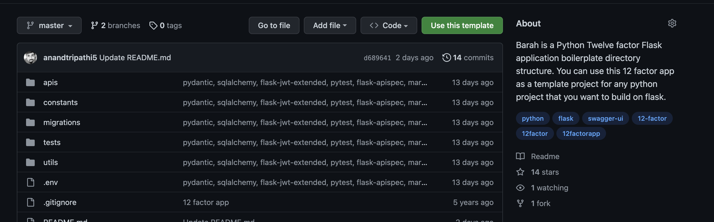
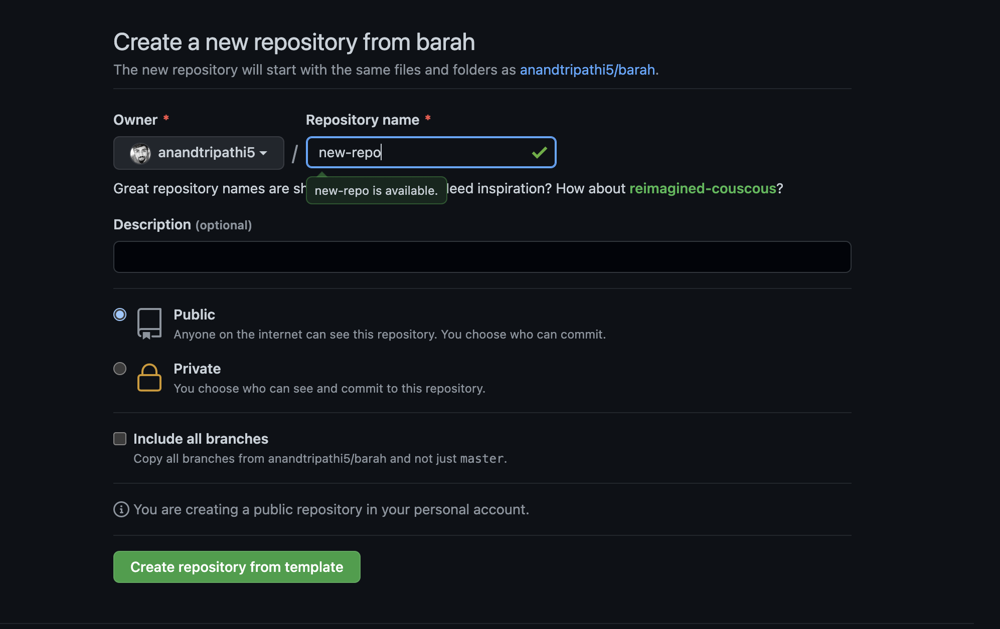

# Barah

A flask boilerplate template with the 12 factors support(twelve factor app).
Simply git clone the repository and use the flask server as per you need

# Features

- Flask directory structure
- Automatic Swagger docs using Flask-Apispec
- Marshmallow and webargs request and response validation
- JWT authentication support
- JWT support in Swagger documentation
- Alembic support for migrations
- Used Flask-restful library for basic structure
- Extensions structure support
- Pydantic support for configuration files.
- Environment variable for configurations
- Test cases using pytest
- SQLAlchemy for database calls
- Docker support

# TODO

- Celery workers

# Command

```shell
docker-compose up --build
```

# Usage

Step 1
------


#### Click on "Use this template" green button on the top-right corner

Step 2
------


#### Create new flask repository with this 12 factor app template

# The [twelve-factor app](http://12factor.net) Checklist Explained

| ✓  | Factors                                                                           | Status                                                                                                                                                                                                                                                                                                                                                                                                                                                                                                                                                                                                                                                                                                                        | Remarks                                                                                                   |
|----|-----------------------------------------------------------------------------------|-------------------------------------------------------------------------------------------------------------------------------------------------------------------------------------------------------------------------------------------------------------------------------------------------------------------------------------------------------------------------------------------------------------------------------------------------------------------------------------------------------------------------------------------------------------------------------------------------------------------------------------------------------------------------------------------------------------------------------|-----------------------------------------------------------------------------------------------------------|
| 1  | CodeBase                                                                          | One codebase tracked in revision control, many deploys. One Code base one repo is handling all the environment ex: production, staging, integration, local                                                                                                                                                                                                                                                                                                                                                                                                                                                                                                                                                                    |                                                                                                           |
| 2  | Dependencies(Explicitly declare and isolate dependencies)                         | All the dependencies are declaraed outside the CodeBase. Pip installable library is used and virtualenv for isolation of dependencies.                                                                                                                                                                                                                                                                                                                                                                                                                                                                                                                                                                                        |                                                                                                           |
| 3  | Config(Store config in the environment)                                           | strict separation of config from code. Config varies substantially across deploys, code does not. Store config in environment variables. Will store env variables in env file not tracked and used by the code, used to declare environment variables only.                                                                                                                                                                                                                                                                                                                                                                                                                                                                   |                                                                                                           |
| 4  | Backing services(Treat backing services as attached resources)                    | A backing service is any service the app consumes over the network as part of its normal operation. Examples include MySQL, RabbitMQ both are attached resources, accessed via a URL or other locator/credentials stored in the config(ENV_VAR). Attached resources must be change without any code changes.(DEPENDENCY ON 3)                                                                                                                                                                                                                                                                                                                                                                                                 | (Dependency on 3)                                                                                         |
| 5  | Build, release, run(Strictly separate build and run stages)                       | We have to maintain three stages to release a project: Build stage(Convert a project to build module using the executable commit from version system it fetches vendors dependencies and compiles binaries and assets.) Release stage (takes the build produced by the build stage and combines it with the deploy’s current config). Run stage(Runs the app in the execution environment, by launching some set of the app’s processes against a selected release using the gunicorn, worker or the supervisor). Have to use some deployement tools so that every release should have a release ID and having the capability to rollback to a particular release ID.Docker-based containerized deploy strategy would be used |                                                                                                           |
| 6  | Processes(Execute the app as one or more stateless processes)                     | App should be stateless and any data that needs to persist should be managed through a stateful backing service like mysql and rabbitMq.The Memory space or filesystem of the process can be used as a brief, single-transaction cache, So that it can be run through multiple processes. And gunicorn maintaining the one or more stateless processes                                                                                                                                                                                                                                                                                                                                                                        |                                                                                                           |
| 7  | Port binding(Export services via port binding)                                    | The web app exports HTTP as a service by binding to a port, and listening to requests coming in on that port. Example: the developer visits a service URL like http://localhost:5000/ to access the service exported by their app. Running the flask app through gunicorn and bind it to IP and PORT which you want to use.                                                                                                                                                                                                                                                                                                                                                                                                   |                                                                                                           |
| 8  | Concurrency(Scale out via the process model)                                      | Architect app to handle diverse workloads by assigning each type of work to a process type. For example, HTTP requests may be handled by a web process, and long-running background tasks handled by a worker process. Application must also be able to span multiple processes running on multiple physical machines.                                                                                                                                                                                                                                                                                                                                                                                                        |                                                                                                           |
| 9  | Disposability(Maximize robustness with fast startup and graceful shutdown)        | Processes should strive to minimize startup time. Ideally, a process takes a few seconds from the time the launch command is executed until the process is up and ready to receive requests or jobs. Short startup time provides more agility for the release process and scaling up; and it aids robustness, because the process manager can more easily move processes to new physical machines when warranted. and a graceful shutdown. Flask server should be shutdown with supervisor stop as it makes the process to shutdown gracefully                                                                                                                                                                                |                                                                                                           |
| 10 | Dev/prod parity(Keep development, staging, and production as similar as possible) | Make the time gap small: a developer may write code and have it deployed hours or even just minutes later.Make the personnel gap small: developers who wrote code are closely involved in deploying it and watching its behavior in production.Make the tools gap small: keep development and production as similar as possible.                                                                                                                                                                                                                                                                                                                                                                                              | deploy time: hours, code authors and deployers: same, Dev and production environment: as same as possible |
| 11 | Logs(Treat logs as event streams)                                                 | App should not attempt to write to or manage logfiles. Instead, each running process writes its event stream, unbuffered, to stdout.In staging or production deploys, each process’ stream will be captured by the execution environment, collated together with all other streams from the app, and routed to one or more final destinations for viewing and long-term archival. Should Follow ELK.                                                                                                                                                                                                                                                                                                                          |                                                                                                           |
| 12 | Admin processes(Run admin/management tasks as one-off processes)                  | Any admin or management tasks for a 12-factor app should be run as one-off processes within a deploy’s execution environment. This process runs against a release using the same codebase and configs as any process in that release and uses the same dependency isolation techniques as the long-running processes.                                                                                                                                                                                                                                                                                                                                                                                                         |                                                                                                           |
